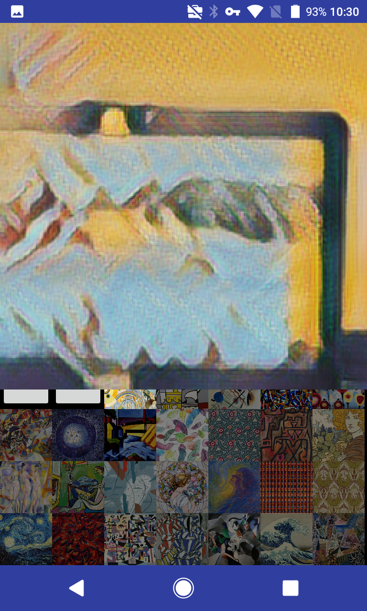

# FunCamera


**Star me if you like it!**

> 因为手头上只有台 `Nexus4` (Android 8.1), 性能实在是不太好, 现在 tensorflow 的 stylish 没法使用, 懒得 debug 了... 暂且放放
> 因为 `build.gradle` 有些地方缺乏实践, 瞎写的, 所以估计过一段时间直接是跑不起来的, 酌情更改 `build.gradle` 文件

## Introduction

> A simple camera app using TensorFlow to classify object and stylize pictures.

> 一款用 TensorFlow 框架来实时物体检测和对照片进行油画风格渲染

## Screenshots





## Credits

## Developer(s)

[DCMMC](https://blog.dcmmcc.tk) - xwt97294597@gmail.com

## LICENSE

```
Copyright 2017 DCMMC

Licensed under the Apache License, Version 2.0 (the "License");
you may not use this file except in compliance with the License.
You may obtain a copy of the License at

   http://www.apache.org/licenses/LICENSE-2.0

Unless required by applicable law or agreed to in writing, software
distributed under the License is distributed on an "AS IS" BASIS,
WITHOUT WARRANTIES OR CONDITIONS OF ANY KIND, either express or implied.
See the License for the specific language governing permissions and
limitations under the License.
```
